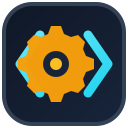

<p align="center">
  
</p>

<h1 align="center">Code Mechanic</h1>

<p align="center">
  <strong>Find less. Change safely. Ship.</strong><br>
  AST-indexed structural retrieval and guarded mechanical refactors for coding agents.
</p>

<p align="center">
  <a href="https://github.com/shipsoftwareai/code-mechanic/actions/workflows/ci.yml"></a>
  <a href="https://github.com/shipsoftwareai/code-mechanic/releases"></a>
  <a href="LICENSE-MIT"></a>
</p>

Coding agents are excellent at reasoning about code, but broad searches and
large source windows spend tokens before reasoning begins. Code Mechanic keeps
a disposable local AST index, returns exact source locations in compact JSON,
and applies repetitive edits through fresh, hash-bound plans.

It complements `rg`, compilers and language servers:

- use `rg` to discover unfamiliar concepts;
- use Code Mechanic to locate or search a known function without loading its
  entire file;
- use a compiler or language server when identity, types or dispatch matter.

## Install

Homebrew on macOS or Linux:

```sh
brew install shipsoftwareai/tap/code-mechanic
```

From source:

```sh
cargo install --locked --git https://github.com/shipsoftwareai/code-mechanic
```

Then, from any repository:

```sh
code-mechanic index
code-mechanic capabilities
```

The disposable SQLite WAL index defaults to `.code-mechanic/index.sqlite`
under the selected root. Add `.code-mechanic/` to the repository's ignore file.

## Supported Languages

| Language | Extensions | Structural coverage |
| --- | --- | --- |
| Rust | `.rs` | Functions, methods and calls |
| C | `.c`, `.h` | Definitions, prototypes and calls |
| C++ | `.cc`, `.cpp`, `.cxx`, `.hh`, `.hpp`, `.hxx` | Definitions, prototypes, inline members and calls |
| Go | `.go` | Functions, receiver methods and calls |
| Objective-C | `.m` | C functions, method declarations/definitions and messages |
| GLSL | `.vert`, `.frag`, `.glsl`, `.geom`, `.comp`, `.tesc`, `.tese` | Definitions, prototypes and calls |

Code Mechanic indexes a file only when its Tree-sitter parse is clean. Run
`diagnostics` to see every refusal rather than receiving incomplete facts that
look authoritative.

## Locator-first Retrieval

Start with the smallest useful response:

```sh
# Compact file, signature, function and body spans—no source body.
code-mechanic locate watch_loop --file src/watcher.rs

# Search only inside that fresh AST body, returning at most five lines.
code-mechanic search-body watch_loop \
  --file src/watcher.rs --pattern reconcile --max-results 5

# Request the entire exact function only when it is genuinely needed.
code-mechanic symbol watch_loop --file src/watcher.rs --raw
```

Byte spans are half-open UTF-8 offsets. Line spans are inclusive and one-based.
Every query verifies the current file content hash before returning data.

Other structural queries:

```sh
code-mechanic status
code-mechanic diagnostics
code-mechanic outline --file src/refactor.rs
code-mechanic refs append_parameter
```

## Guarded Refactors

Every edit previews by default. Applying requires the exact plan ID from a
fresh preview:

```sh
preview=$(code-mechanic rename --from old_name --to new_name)
plan=$(printf '%s' "$preview" | jq -r .plan_id)
code-mechanic rename \
  --from old_name --to new_name --apply --expect-plan "$plan"
```

Available operations:

```sh
# Rename the unique definition, compatible prototypes and indexed calls.
code-mechanic rename --from old_name --to new_name

# Insert immediately inside a braced function body.
code-mechanic inject-entry --symbol tick --code 'trace_tick();'

# Replace only the contents of a braced body; keep the signature and braces.
code-mechanic replace-body --symbol calculate \
  --code $'let result = input * 2;\nresult'

# Append a language-native formal parameter and matching call argument.
code-mechanic append-parameter --symbol send \
  --parameter 'timeout: Duration' --argument 'DEFAULT_TIMEOUT'
```

Plans reject stale files, ambiguity, unexpected source bytes, overlapping
edits and post-edit parse errors. Multi-file writes are staged beside their
targets, atomically renamed, and rolled back when a later commit fails.

Read [Refactor safety](docs/REFACTOR-SAFETY.md) before using name-based edits in
code with overloads, traits, macros, interface dispatch or preprocessor
variants. Code Mechanic is source-aware, not a compiler semantic model.

## Watch Without Leaving Daemons Behind

Watchers are foreground processes and bounded by default:

```sh
code-mechanic watch
code-mechanic watch --duration-seconds 300 --until-idle-seconds 30

code-mechanic watchers list
code-mechanic watchers stop-all
code-mechanic watchers stop-all --force --grace-ms 750
code-mechanic watchers prune
```

The default watcher exits after 30 seconds or two idle seconds. `--forever` is
an explicit opt-in, still handles termination signals, and remains visible in
the per-user watcher registry.

## Does It Actually Save Tokens?

The built-in benchmark uses the local `o200k_base` tokenizer and requires exact
answer equivalence. It compares a workspace text scan plus source window, the
exact function body, and the source-free locator:

```sh
code-mechanic bench \
  --case watch_loop:src/watcher.rs \
  --case append_parameter:src/refactor.rs \
  --warm-runs 10 --window-lines 120 \
  --min-token-reduction-pct 0 \
  --output target/code-mechanic-benchmark.json
```

In the original 2,009-file adoption codebase, representative Go, C++,
Objective-C and GLSL functions totalled 6,092 body tokens while their locators
totalled 369—a 93.94% reduction relative to retrieving every body. A tiny
function can cost more as a locator than as source; the benchmark reports that
honestly. See [Benchmark methodology](docs/BENCHMARKS.md).

## Agent Harnesses

Compact one-line JSON is the default. Successful machine-readable output goes
to stdout; structured errors go to stderr with a non-zero exit status.
`capabilities` exposes the stable surface without opening an index.

See [Agent harness integration](docs/AGENT-HARNESS.md) for an `AGENTS.md`
snippet, lifecycle guidance and command recipes.

## Documentation

- [Architecture](docs/ARCHITECTURE.md)
- [Agent harness integration](docs/AGENT-HARNESS.md)
- [Refactor safety](docs/REFACTOR-SAFETY.md)
- [Benchmark methodology](docs/BENCHMARKS.md)
- [Contributing](CONTRIBUTING.md)
- [Security policy](SECURITY.md)

## Project Status

Code Mechanic is young and intentionally conservative. Its index is disposable;
source files remain authoritative. The next high-value designs are transactional
file moves with language-specific dependency rewrites and richer signature
migrations backed by compiler or language-server identity.

Licensed under either [MIT](LICENSE-MIT) or [Apache License 2.0](LICENSE-APACHE),
at your option.
